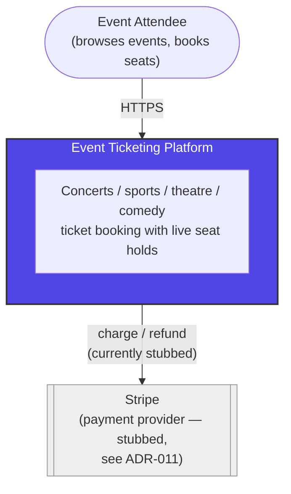
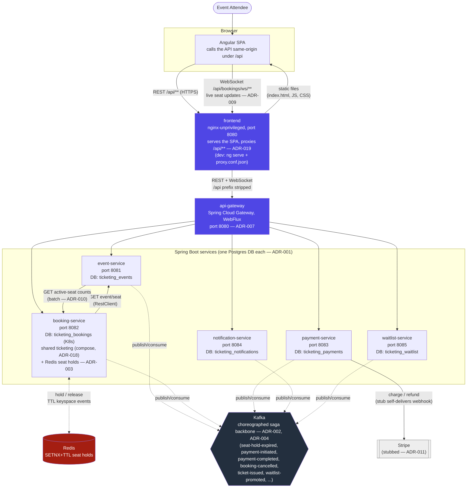

# C4 Diagrams — Event Ticketing Platform

Two levels are useful here: **Context** (the system as one box, who/what
talks to it) and **Container** (the six services, the frontend, and the
infrastructure between them). Rendered as GitHub-native Mermaid, not
external images, so they stay viewable and diffable in the repo.

See [`docs/plan.md`](../plan.md) for the narrative history and
[`docs/adr/`](../adr/) for the reasoning behind each architectural
choice referenced below.

## Level 1 — System Context

## Level 2 — Containers

**Reading the choreography**: no service calls another to trigger a saga
step — each service reacts to Kafka events published by others (ADR-002).
The two synchronous, request/response exceptions are booking-service
calling event-service to validate a seat/event at hold time, and
event-service calling booking-service's batch endpoint to compose live
seat availability (ADR-010) — both plain reads, not saga steps.
